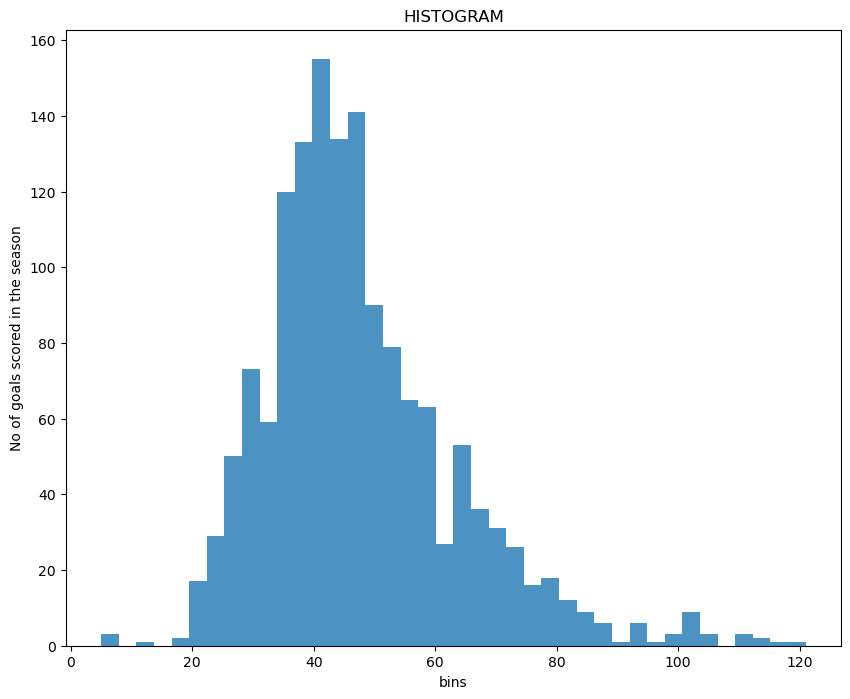

# Investigating a Dataset - [Database_soccer]

## Project Overview

This project has five major stages

1.**Choose the Data Set:** 

The data to be used is downloaded from the link provided in a Google doc [here]()

2.**Get Organized**

Create a single folder that will eventually contain, the report communicating the findings, Python code written as part of the analysis, and the data set used.

3.**Analyze the Data**

Assess the dataset and brainstorm some questions that could be answered using the dataset. These questions should aim at looking at relationships between multiple variables, clearly identifying dependent and independent variables.

4.**Share the Findings**

After analyzing the data, create a report that shares the findings found to be most interesting.

5.**Review**

Use the Project Rubric to review and improve the project. 

## Project Details

The project involves conducting data analysis; data gathering, data cleaning, data visualization as well as sharing the findings. I'll start by assessing the dataset, and brainstorming appropriate questions could be answered using it. Then I'll use pandas and NumPy to answer the questions and create a report sharing the answers. 

## What I need to install

I will install Python, plus the following libraries:

* pandas
* NumPy
* Matplotlib
* csv

## Why this Project

In this project, I'll go through the data analysis process and see how everything fits together using the Python libraries NumPy, pandas, and Matplotlib, which make writing data analysis code in Python a lot easier. I will also clean and combine all the seven datasets into one master dataset to be used in the analysis

## Project Questions for Analysis

1. What is the league table for the 4 major leagues in europe during 2015/2016 season?
2. Which are the top 3 teams for each league in 2015/2016 season? 
3. What teams improved the most over the time period?

## Dataset

In this project, I will analyze a soccer dataset [here](https://www.kaggle.com/datasets/hugomathien/soccer/download?datasetVersionNumber=10) and then communicate the findings about it.

## Dataset Description

In this project, I willl be analysing ultimate soccer [dataset](https://www.kaggle.com/datasets/hugomathien/soccer), which is an open-source dataset in kaggle. The dataset is a one .sql file comprising _seven tables_, each with different(unique) but interrelated features. 

- **Country table** has 11 European countries. 
- **League table** has 11 lead championship names. The country and league tables are related by their ID. 
- **Match table** has over 25,000 matches for different seasons as well as betting odds from upto 10 providers. The match table is also related to the previous tables by country_id. 
- **Player table** contains 11 columns including playes name, birthday, fifa_api_id, weight, and height 
- **Player_Attributes table** has 42 player attributes.
- **Team table** contains tema long name, short name, team api id, team fifa api id.
- **Team_Attributes table** has 25 team attributes.

## Data Cleaning

First, I want to create functions that will help me drop duplicates, merge two datasets, change data type, remove missing rows, drop unnecessary columns, then proceed to to merge the country data to that for league. I will correct the league name for Germany 1. Bundesliga to Germany Bundesliga 1. I will also change the name column for both the country data and league data, and also make the datafrmaes have the same dimensions and finally merge the two dataframes into country_league data using the country id as the key

## Findings

### The distribution of goals throughout the seasons
 

### League table for 4 major leagues in Europe during 2015/2016 season

### England Premier League Table
|   Pos | Club                 |   MP |   W |   D |   L |   Pts |   GF |   GA |   GD |   avg_goals |
|------:|:---------------------|-----:|----:|----:|----:|------:|-----:|-----:|-----:|------------:|
|     1 | Leicester City       |   38 |  23 |  12 |   3 |    81 |   68 |   36 |   32 |    1.78947  |
|     2 | Arsenal              |   38 |  20 |  11 |   7 |    71 |   65 |   36 |   29 |    1.71053  |
|     3 | Tottenham Hotspur    |   38 |  19 |  13 |   6 |    70 |   69 |   35 |   34 |    1.81579  |
|     4 | Manchester City      |   38 |  19 |   9 |  10 |    66 |   71 |   41 |   30 |    1.86842  |
|     5 | Manchester United    |   38 |  19 |   9 |  10 |    66 |   49 |   35 |   14 |    1.28947  |
|     6 | Southampton          |   38 |  18 |   9 |  11 |    63 |   59 |   41 |   18 |    1.55263  |
|     7 | West Ham United      |   38 |  16 |  14 |   8 |    62 |   65 |   51 |   14 |    1.71053  |
|     8 | Liverpool            |   38 |  16 |  12 |  10 |    60 |   63 |   50 |   13 |    1.65789  |
|     9 | Stoke City           |   38 |  14 |   9 |  15 |    51 |   41 |   55 |  -14 |    1.07895  |
|    10 | Chelsea              |   38 |  12 |  14 |  12 |    50 |   59 |   53 |    6 |    1.55263  |
|    11 | Everton              |   38 |  11 |  14 |  13 |    47 |   59 |   55 |    4 |    1.55263  |
|    12 | Swansea City         |   38 |  12 |  11 |  15 |    47 |   42 |   52 |  -10 |    1.10526  |
|    13 | Watford              |   38 |  12 |   9 |  17 |    45 |   40 |   50 |  -10 |    1.05263  |
|    14 | West Bromwich Albion |   38 |  10 |  13 |  15 |    43 |   34 |   48 |  -14 |    0.894737 |
|    15 | Crystal Palace       |   38 |  11 |   9 |  18 |    42 |   39 |   51 |  -12 |    1.02632  |
|    16 | Bournemouth          |   38 |  11 |   9 |  18 |    42 |   45 |   67 |  -22 |    1.18421  |
|    17 | Sunderland           |   38 |   9 |  12 |  17 |    39 |   48 |   62 |  -14 |    1.26316  |
|    18 | Newcastle United     |   38 |   9 |  10 |  19 |    37 |   44 |   65 |  -21 |    1.15789  |
|    19 | Norwich City         |   38 |   9 |   7 |  22 |    34 |   39 |   67 |  -28 |    1.02632  |
|    20 | Aston Villa          |   38 |   3 |   8 |  27 |    17 |   27 |   76 |  -49 |    0.710526 |

### France Ligue 1 League Table
|   Pos | Club                   |   MP |   W |   D |   L |   Pts |   GF |   GA |   GD |   avg_goals |
|------:|:-----------------------|-----:|----:|----:|----:|------:|-----:|-----:|-----:|------------:|
|     1 | Paris Saint-Germain    |   38 |  30 |   6 |   2 |    96 |  102 |   19 |   83 |    2.68421  |
|     2 | Olympique Lyonnais     |   38 |  19 |   8 |  11 |    65 |   67 |   43 |   24 |    1.76316  |
|     3 | AS Monaco              |   38 |  17 |  14 |   7 |    65 |   57 |   50 |    7 |    1.5      |
|     4 | OGC Nice               |   38 |  18 |   9 |  11 |    63 |   58 |   41 |   17 |    1.52632  |
|     5 | LOSC Lille             |   38 |  15 |  15 |   8 |    60 |   39 |   27 |   12 |    1.02632  |
|     6 | AS Saint-Étienne       |   38 |  17 |   7 |  14 |    58 |   42 |   37 |    5 |    1.10526  |
|     7 | SM Caen                |   38 |  16 |   6 |  16 |    54 |   39 |   52 |  -13 |    1.02632  |
|     8 | Stade Rennais FC       |   38 |  13 |  13 |  12 |    52 |   52 |   54 |   -2 |    1.36842  |
|     9 | Angers SCO             |   38 |  13 |  11 |  14 |    50 |   40 |   38 |    2 |    1.05263  |
|    10 | SC Bastia              |   38 |  14 |   8 |  16 |    50 |   36 |   42 |   -6 |    0.947368 |
|    11 | Girondins de Bordeaux  |   38 |  12 |  14 |  12 |    50 |   50 |   57 |   -7 |    1.31579  |
|    12 | Montpellier Hérault SC |   38 |  14 |   7 |  17 |    49 |   49 |   47 |    2 |    1.28947  |
|    13 | Olympique de Marseille |   38 |  10 |  18 |  10 |    48 |   48 |   42 |    6 |    1.26316  |
|    14 | FC Nantes              |   38 |  12 |  12 |  14 |    48 |   33 |   44 |  -11 |    0.868421 |
|    15 | FC Lorient             |   38 |  11 |  13 |  14 |    46 |   47 |   58 |  -11 |    1.23684  |
|    16 | En Avant de Guingamp   |   38 |  11 |  11 |  16 |    44 |   47 |   56 |   -9 |    1.23684  |
|    17 | Toulouse FC            |   38 |   9 |  13 |  16 |    40 |   45 |   55 |  -10 |    1.18421  |
|    18 | Stade de Reims         |   38 |  10 |   9 |  19 |    39 |   44 |   57 |  -13 |    1.15789  |
|    19 | GFC Ajaccio            |   38 |   8 |  13 |  17 |    37 |   37 |   58 |  -21 |    0.973684 |
|    20 | ES Troyes AC           |   38 |   3 |   9 |  26 |    18 |   28 |   83 |  -55 |    0.736842 |

### Spain LIGA BBVA League Table
|   Pos | Club                    |   MP |   W |   D |   L |   Pts |   GF |   GA |   GD |   avg_goals |
|------:|:------------------------|-----:|----:|----:|----:|------:|-----:|-----:|-----:|------------:|
|     1 | FC Barcelona            |   38 |  29 |   4 |   5 |    91 |  112 |   29 |   83 |    2.94737  |
|     2 | Real Madrid CF          |   38 |  28 |   6 |   4 |    90 |  110 |   34 |   76 |    2.89474  |
|     3 | Atletico Madrid         |   38 |  28 |   4 |   6 |    88 |   63 |   18 |   45 |    1.65789  |
|     4 | Villarreal CF           |   38 |  18 |  10 |  10 |    64 |   44 |   35 |    9 |    1.15789  |
|     5 | Athletic Club de Bilbao |   38 |  18 |   8 |  12 |    62 |   58 |   45 |   13 |    1.52632  |
|     6 | RC Celta de Vigo        |   38 |  17 |   9 |  12 |    60 |   51 |   59 |   -8 |    1.34211  |
|     7 | Sevilla FC              |   38 |  14 |  10 |  14 |    52 |   51 |   50 |    1 |    1.34211  |
|     8 | Malaga CF               |   38 |  12 |  12 |  14 |    48 |   38 |   35 |    3 |    1        |
|     9 | Real Sociedad           |   38 |  13 |   9 |  16 |    48 |   45 |   48 |   -3 |    1.18421  |
|    10 | Real Betis              |   38 |  11 |  12 |  15 |    45 |   34 |   52 |  -18 |    0.894737 |
|    11 | Valencia CF             |   38 |  11 |  11 |  16 |    44 |   46 |   48 |   -2 |    1.21053  |
|    12 | UD Las Palmas           |   38 |  12 |   8 |  18 |    44 |   45 |   53 |   -8 |    1.18421  |
|    13 | SD Eibar                |   38 |  11 |  10 |  17 |    43 |   49 |   61 |  -12 |    1.28947  |
|    14 | RCD Espanyol            |   38 |  12 |   7 |  19 |    43 |   40 |   74 |  -34 |    1.05263  |
|    15 | Deportivo La Coruna     |   38 |   8 |  18 |  12 |    42 |   45 |   61 |  -16 |    1.18421  |
|    16 | Sporting Gijon          |   38 |  10 |   9 |  19 |    39 |   40 |   62 |  -22 |    1.05263  |
|    17 | Granada CF              |   38 |  10 |   9 |  19 |    39 |   46 |   69 |  -23 |    1.21053  |
|    18 | Rayo Vallecano          |   38 |   9 |  11 |  18 |    38 |   52 |   73 |  -21 |    1.36842  |
|    19 | Getafe CF               |   38 |   9 |   9 |  20 |    36 |   37 |   67 |  -30 |    0.973684 |
|    20 | Levante UD              |   38 |   8 |   8 |  22 |    32 |   37 |   70 |  -33 |    0.973684 |

### Italy Serie A League Table
|   Pos | Club          |   MP |   W |   D |   L |   Pts |   GF |   GA |   GD |   avg_goals |
|------:|:--------------|-----:|----:|----:|----:|------:|-----:|-----:|-----:|------------:|
|     1 | Juventus      |   38 |  29 |   4 |   5 |    91 |   75 |   20 |   55 |    1.97368  |
|     2 | Napoli        |   38 |  25 |   7 |   6 |    82 |   80 |   32 |   48 |    2.10526  |
|     3 | Roma          |   38 |  23 |  11 |   4 |    80 |   83 |   41 |   42 |    2.18421  |
|     4 | Inter         |   38 |  20 |   7 |  11 |    67 |   50 |   38 |   12 |    1.31579  |
|     5 | Fiorentina    |   38 |  18 |  10 |  10 |    64 |   60 |   42 |   18 |    1.57895  |
|     6 | Sassuolo      |   38 |  16 |  13 |   9 |    61 |   49 |   40 |    9 |    1.28947  |
|     7 | Milan         |   38 |  15 |  12 |  11 |    57 |   49 |   43 |    6 |    1.28947  |
|     8 | Lazio         |   38 |  15 |   9 |  14 |    54 |   52 |   52 |    0 |    1.36842  |
|     9 | Chievo Verona |   38 |  13 |  11 |  14 |    50 |   43 |   45 |   -2 |    1.13158  |
|    10 | Genoa         |   38 |  13 |   7 |  18 |    46 |   45 |   48 |   -3 |    1.18421  |
|    11 | Empoli        |   38 |  12 |  10 |  16 |    46 |   40 |   49 |   -9 |    1.05263  |
|    12 | Torino        |   38 |  12 |   9 |  17 |    45 |   52 |   55 |   -3 |    1.36842  |
|    13 | Atalanta      |   38 |  11 |  12 |  15 |    45 |   41 |   47 |   -6 |    1.07895  |
|    14 | Bologna       |   38 |  11 |   9 |  18 |    42 |   33 |   45 |  -12 |    0.868421 |
|    15 | Sampdoria     |   38 |  10 |  10 |  18 |    40 |   48 |   61 |  -13 |    1.26316  |
|    16 | Udinese       |   38 |  10 |   9 |  19 |    39 |   35 |   60 |  -25 |    0.921053 |
|    17 | Palermo       |   38 |  10 |   9 |  19 |    39 |   38 |   65 |  -27 |    1        |
|    18 | Carpi         |   38 |   9 |  11 |  18 |    38 |   37 |   57 |  -20 |    0.973684 |
|    19 | Frosinone     |   38 |   8 |   7 |  23 |    31 |   35 |   76 |  -41 |    0.921053 |
|    20 | Hellas Verona |   38 |   5 |  13 |  20 |    28 |   34 |   63 |  -29 |    0.894737 |

The top 3 most improved teams are Paris Saint_Germain, Napoli and Cracovia.

## Limitations

The soccer database is a very extensive data. In, seeking to address the three questions in the description, I was able to show only the correltaion between the number of goals scored in the two season. However, the other seasons were not considered.The data base had a lot of unprocessed html files under certain columns, which made take a lot of time thinking on how well they can be used in the analysis. In addition, the data had a lot of missing and duplicate values. Identifying such inconsistencies, wss realy time consuming.

Another limitation is that in the creation of bar graph for the most improved teams, the bars are not sorted in order of either increasing or decreasing frequency, which would have enabled the identification of the improved teams easily. In getting the most preffered leg, it was only based on the year 2016 instead of the whole duration of time.

## Conclusions

The soccer database has five datasets, league, country, player, player attribute, team and team attribute. It is a detailed dabase for European major leagues covering several seasons from 2008/2009 t0 2015/2016.

The project seeks to answer three questions, what teams improved the most over the time period, which players had the most penalties and which was the the most preferred leg for penalty-takers in 2016 among the players who scored more than the mean penalties in that year?

In attempting to find solutions to the question, each dataset was examineed for inconsistencies, colomn names, corrected, missing values replace or droped in certain datasets before they were finally merged and cleaned. Visual presentations created and inteprated.

From the analysis and visualization, Richie Lambert is the player who scored most of the penalties. I also found that Paris Saint-Germain is the most improved team over the period of time given, followed by Napoli and Cracovia being the in the third position. Moreover, the findings also indicate that most of the penalty takers in 2016 preferred right leg compared to the right leg. The findings also shows that the distribution of the number of goals scored in the two seasons are right skewed.

Whereas I was able to show that there is a correltaion between the number of goals scored in the two extreme seasons (2008/2009 and 2015/2016), theer are other seasons that were not considered. There is likelihood that a team that improved between the two seasons might not have improved in the seasons prior 2015/2016. Goal difference between the two seasons was used as a measured of improvement in performance because the ultimate objective of team managers, players and teams is to improve to score goals, but there could be criteria for measuring performance.

## Skills learned

- The steps involved in a typical data analysis process
- Formulating the research questions that can be answered with a given dataset and then answering those questions
- Investigating problems in a dataset and wrangle the data into a format that can be used
- Communicating the results of the analysis
- Vectorized operations in NumPy and pandas to speed up your data analysis code
- Pandas' Series and DataFrame objects
- Matplotlib skills to produce plots showing findings
